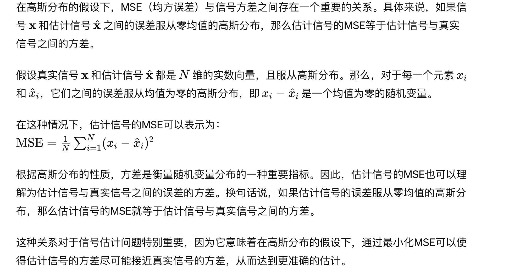

# Towards Convergent Approximate Message Passing by Alternating Constrained Minimization of Bethe Free

## Abstract

Generalized Approximate Message Passing (GAMP) allows for Bayesian inference in linear models with non-identically independently distributed (n.i.i.d.) priors and n.i.i.d. measurements of the linear mixture outputs.

_**非独立同分布（n.i.i.d.）解释**_

_在统计分析中，“非独立同分布”（n.i.i.d.）指的是一系列随机变量，这些变量不必遵循相同的概率分布，但彼此独立。这与独立同分布（i.i.d.）变量相反，后者既独立又遵循相同的分布。**n.i.i.d.** 条件放宽了每个变量必须遵循相同分布的要求，允许统计模型中存在更广泛的变异性和复杂性。这一概念在处理多样化数据源和类型的领域（如机器学习和信号处理）中尤其相关。_

It has been shown that the fixed points of GAMP correspond to the extrema of a large system limit of the Bethe Free Energy <mark style="color:red;">(LSL-BFE)</mark>

However, the convergence of (G)AMP can be problematic for certain measurement matrices.

we revisit the GAMP algorithm by applying a simplified version of the <mark style="color:red;">Alternating Direction Method of Multipliers (ADMM) t</mark>o minimizing the LSLBFE.

We show convergence of <mark style="color:red;">the mean and variance subsystems</mark> in AMBGAMP and <mark style="color:red;">in the Gaussian case</mark>, convergence of mean and LSL variance to the Minimum Mean Squared Error (MMSE) quantities.

## Introduction

#### Approximate Message Passing Update Rule

The Approximate Message Passing (AMP) algorithm employs iterative update rules to estimate the signals in systems modeled by linear measurements with added noise. The fundamental update rules for the AMP algorithm are as follows:

1. **Message Update**: At every iteration $t$, for every variable node $i$ in the system, update the message as: $$m_i^{(t+1)} = f\left(\sum_{j}A_{ij}z_j^{(t)} + x_i^{(t)}\right)$$ where $A\_{ij}$ represents the elements of the measurement matrix, $z\_j^{(t)}$ are the <mark style="color:red;">auxiliary variables</mark>, $x\_i^{(t)}$ the <mark style="color:red;">current estimate of the $i$-th variable,</mark> and $f(\cdot)$ a non-linear function derived from the prior distribution of the variables.
2. **Auxiliary Variable Update**: Simultaneously, update the auxiliary variable $z\_j^{(t)}$ based on the <mark style="color:red;">residual error</mark> and the <mark style="color:red;">Onsager correction</mark> term as: $$z_j^{(t+1)} = y_j - \sum_{i}A_{ij}m_i^{(t+1)} + \frac{z_j^{(t)}}{N}\sum_{i}\frac{\partial f}{\partial x_i}\bigg|_{x_i=x_i^{(t)}}$$ In this equation, $y\_j$ represents the $j$-th measurement, and $\frac{\partial f}{\partial x\_i}$ denotes the derivative of the update function with respect to its input, evaluated at the current estimate. $N$ is the total number of variable nodes.

The AMP algorithm iterates these steps until a convergence criterion is met, such as a minimal difference in the estimate or reaching a maximal number of iterations. The convergence to meaningful estimates highly depends on the characteristics of the measurement matrix and the accuracy of the model assumptions regarding noise and signal priors

&#x20;Onsager correction term

The Onsager correction term is calculated during each iteration of the AMP algorithm as part of the auxiliary variable update step. Specifically, it is given by:

\[ \text{Onsager correction term} = \frac{1}{N} \sum\_{i=1}^{N} \frac{\partial f(x\_i^{(t)})}{\partial x\_i} \cdot z\_j^{(t-1)} ]

where:

* $N$ is the total number of variable nodes,
* $\frac{\partial f(x\_i^{(t)})}{\partial x\_i}$ is the derivative of the non-linear function $f$ applied to the current estimate $x\_i^{(t)}$ of the $i$-th variable, and
* $z\_j^{(t-1)}$ is the auxiliary variable from the previous iteration.

This term is subtracted from the update of the auxiliary variable to mitigate the effects of the correlations introduced by iterative updates, thereby enhancing the algorithm's stability and convergence.

一些收敛性证明的方法和思路包括但不限于：

1. **随机收敛性分析：** 使用随机过程理论和概率论分析算法在随机观测下的收敛性。
2. **凸优化理论：** 将GAMP算法的迭代更新视为一种凸优化问题，并利用凸优化理论分析其收敛性。
3. **误差传播分析：** 分析算法迭代过程中误差的传播规律，推导误差的收敛性。
4. **收敛速度分析：** 通过分析算法迭代过程中的收敛速度，推导收敛性的结果。

<figure><figcaption></figcaption></figure>

<figure><figcaption></figcaption></figure>

<figure><figcaption></figcaption></figure>

<figure><figcaption></figcaption></figure>

在高斯分布的假设下，意味着我们假设信号的真实值以及估计值都符合高斯分布。而"估计信号与真实信号误差服从高斯"的意思是，我们认为估计信号与真实信号之间的差异，即估计误差，也符合高斯分布。

### 中心极限定理

中心极限定理表明，当独立随机变量之和足够大时，其分布接近于正态分布，无论原始随机变量的分布如何。这一定理对统计学和概率论具有重要意义，因为它意味着在许多实际情况下，可以用高斯分布来近似描述大量随机变量的总和或平均值。

#### Alternating Minimization (交替最小化) 优化算法

Alternating Minimization 是一种用于求解优化问题的迭代算法。其基本思想是将一个难以直接解决的大问题分解成两个或多个更容易解决的子问题，然后交替对每个子问题进行求解，通过迭代更新来逐步逼近全局最优解。该方法在机器学习和信号处理等领域有广泛应用。

**算法步骤：**

1. \*\*初始化：\*\*选择一个起始点作为参数的初始估计值。
2. **交替优化：**
   * 固定某些参数，优化其他参数。
   * 然后固定刚才优化过的参数，再优化其它参数。
3. \*\*迭代：\*\*重复步骤2，直到满足收敛条件，例如迭代次数达到预设值或连续两次迭代结果的差异小于某个阈值。

**应用场景：**

交替最小化算法在多个不同的领域都有应用，如:

* **矩阵分解**（Matrix Factorization）,
* **图像恢复**（Image Restoration）,
* **机器学习中的优化问题**等。

**优点：**

* 易于实现和理解。
* 对于某些特定问题能够快速收敛。

**缺点：**

* 并非总能保证找到全局最优解。
* 性能依赖于初始化条件。

#### Replica方法在近似计算最小均方误差（MMSE）估计器方面的优缺点

**优点：**

* 易于实现和理解。
* 对于某些特定问题能够快速收敛。

**缺点：**

* 并非总能保证找到全局最优解。
* 性能依赖于初始化条件。

Replica method 是一种基于统计物理学原理的技术，用于分析复杂系统的性能，特别是在通信理论和机器学习中。该方法可以用于近似计算最小均方误差（MMSE）估计器的性能。具体步骤如下：

1. **建立系统模型**：首先定义系统的数学模型，包括观测模型、未知参数的先验分布等。
2. **引入复制品**：在 replica method 中，通过引入系统的“复制品”或“副本”，能够使得复杂的多体相互作用问题简化为能够处理的有效单体问题。
3. **计算自由能**：计算系统的自由能，这一步通常涉及到统计物理中的平均场理论。自由能可以通过考虑系统副本在热力学极限下的性质来计算。
4. **应用复制对称假设**：通过应用所谓的复制对称（replica symmetry）假设来简化计算，这一假设假定所有副本之间的对称性。
5. **求解自由能的极值**：通过求解自由能关于相关参数的极值，可以得到系统的关键量，例如系统的均方误差。
6. **恢复MMSE估计器的性能**：最后，通过对自由能或其导数进行适当的解读，可以近似计算最小均方误差（MMSE）估计器的性能。

使用 replica method 近似计算 MMSE 估计器时需要数学和统计物理的先验知识，尤其是在自由能的计算和副本对称假设的应用方面。此方法对于理解估计器在高维情况下的性能特别有用，但也要注意其局限性，比如复制对称假设在某些情况下可能不成立。

### Replica Method Overview

The Replica method is a technique grounded in statistical physics principles, designed for analyzing the performance of complex systems, particularly in fields such as communication theory and machine learning. It is notably utilized for approximating the performance of Minimum Mean Square Error (MMSE) estimators through a series of structured steps:

1. **System Model Establishment**: Define the mathematical model of the system, including observation models and the prior distribution of unknown parameters.
2. **Replica Introduction**: Simplify the complex multibody interaction problem into a manageable single-body issue by introducing "replicas" or "copies" of the system.
3. **Free Energy Calculation**: Compute the system's free energy, often involving average field theory from statistical physics. This calculation considers the properties of system replicas under thermodynamic limit.
4. **Replica Symmetry Assumption**: Simplify calculations by adopting the replica symmetry assumption, which posits symmetry among all replicas.
5. **Free Energy Extremum Resolution**: Determine the system's key metrics, like mean square error, by solving for the extrema of free energy in relation to relevant parameters.
6. **MMSE Estimator Performance Recovery**: Approximate MMSE estimator performance by interpreting free energy or its derivatives appropriately.

Utilizing the replica method for approximating MMSE estimator performance requires prior knowledge in mathematics and statistical physics, especially concerning free energy calculations and the application of the replica symmetry assumption. This method is particularly valuable for understanding estimator performance in high-dimensional scenarios but also carries limitations, such as potential inapplicability of the replica symmetry assumption in some cases.

