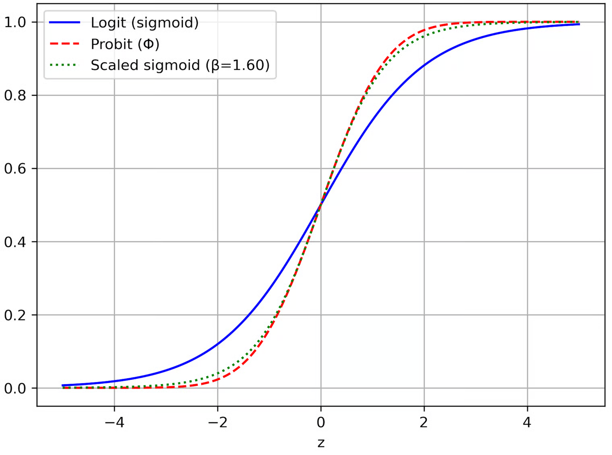

# fx->w

#### 在原始的文章，公式的推导是（为了和后边的区别，采用Low Complexity Sparse Bayesian Learning Using Combined BP and MF with a Stretched Factor Graph中的表达）其中

$$
f(x) 是高斯，均值0，方差\gamma^{-1}_l
$$

$$
\begin{align}
m_{f_{\alpha_\ell} \to \gamma_\ell}(\gamma_\ell) 
&= \exp \left\{ \left\langle \log f_{\alpha_\ell}(\alpha_\ell,\gamma_\ell) \right\rangle_{b(\alpha_\ell)} \right\} \\
&= \exp \left\{   \int b(\alpha_l) \log f_{\alpha_\ell}(\alpha_\ell,\gamma_\ell) d\alpha_l \right\} \\
&= \exp \left\{   \int b(\alpha_l) \log  (N(\alpha_l; 0, \gamma_l^{-1})) d\alpha_l \right\} \\
&= \exp \left\{   \int b(\alpha_l) (\log(\pi^{-1} \gamma_l) - \gamma_l |\alpha_l|^2) d\alpha_l \right\} \\
&= \exp \left\{  \log(\pi^{-1} \gamma_l)  \right\} \times\exp \left\{   \int b(\alpha_l) (  - \gamma_l |\alpha_l|^2) d\alpha_l \right\}\\
&=  (\pi^{-1} \gamma_l)  \exp \left\{ - \gamma_l  \int b(\alpha_l)    |\alpha_l|^2 d\alpha_l \right\}\\
&\propto \gamma_\ell \exp \left\{ -\gamma_\ell \left( |\hat{\alpha}_\ell|^2 + \nu_{\alpha_\ell} \right) \right\} ,  
\end{align}
$$

### fx是ELM学习的，

## ELM（无监督）

(1)隐层

$$
h(x) = sigmoid(V x + b)，其中 sigmoid(z) = 1 / (1 + exp(-z))
$$

(2)网络输出层

$$
y (x) = w^T h(x)；多输出时用矩阵 W：y(x) = H(x) W
$$

(3) 流程

* 随机初始化并固定输入→隐层的权重 V 和偏置 b；

### 重新计算 $$m_{f_{\alpha_\ell} \to w_\ell}(w_\ell)$$

和原来的区别是， $$w_\ell$$ is vetor and weight&#x20;

<figure><figcaption></figcaption></figure>

### 情况1:

如果 $$f(x) =w^T \times sigmoid(V x + b) , 其中 sigmoid(z) =\eth(z)= 1 / (1 + exp(-z)),$$

在 $$b(x)=\mathcal{N}(\mu,\Sigma)$$ 下，

$$
\begin{align}
m_{f_{x_\ell} \to w_\ell}(w_\ell) 
&= \exp \left\{ \left\langle \log f_{x_\ell}(x_\ell,w_\ell) \right\rangle_{b(x_\ell)} \right\} \\
&=   \exp{∫ b(x_l) log( w^T \eth(V x_l + b) ) dx_l }\\
&=  \exp\left\{{ E_{b(x_l)} [ log( w^T \eth(V x_l + b) ) ] }\right\} \\
&\propto    
\end{align}
$$

(1)Jensen 上界

$$
\mathbb{E}\!\left[\log\sum_{i=1}^L w_i\,\eth(Z_i)\right]
\;\le\;
\log\left(\sum_{i=1}^L w_i\,\mathbb{E}[ \eth(Z_i)]\right),
$$

log is concave and has upper bound.&#x20;

$$
\begin{align}
m_{f_{x_\ell} \to w_\ell}(w_\ell) 
&= \exp \left\{ \left\langle \log f_{x_\ell}(x_\ell,w_\ell) \right\rangle_{b(x_\ell)} \right\} \\
&=   \exp{∫ b(x_l) log( w^T \eth(V x_l + b) ) dx_l }\\
&=  \exp\left\{{ E_{b(x_l)} [ log( w^T \eth(V x_l + b) ) ] }\right\} \\
&\;\le\;
\exp \left(\log\!\left(\sum_{i=1}^L w_i\,\mathbb{E}[\sigma(Y_i)]\right)\right)\\
&\propto    
\end{align}
$$

