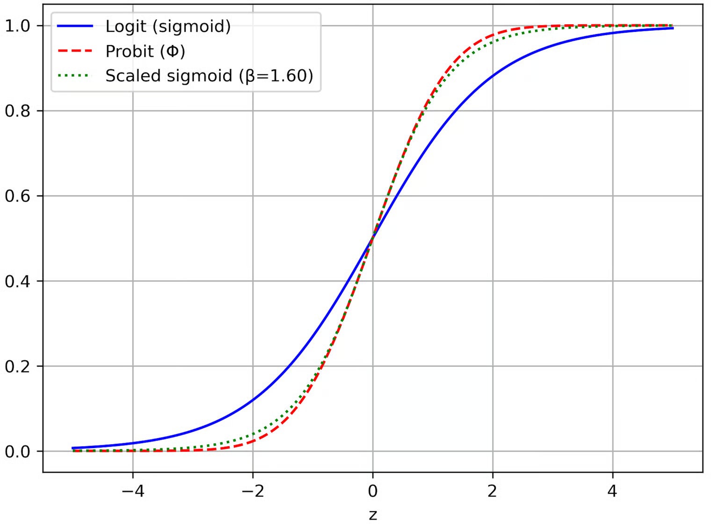

# fx->w

#### 在原始的文章，公式的推导是（为了和后边的区别，采用Low Complexity Sparse Bayesian Learning Using Combined BP and MF with a Stretched Factor Graph中的表达）其中

$$
f(x) 是高斯，均值0，方差\gamma^{-1}_l
$$

$$
\begin{align}
m_{f_{\alpha_\ell} \to \gamma_\ell}(\gamma_\ell) 
&= \exp \left\{ \left\langle \log f_{\alpha_\ell}(\alpha_\ell,\gamma_\ell) \right\rangle_{b(\alpha_\ell)} \right\} \\
&= \exp \left\{   \int b(\alpha_l) \log f_{\alpha_\ell}(\alpha_\ell,\gamma_\ell) d\alpha_l \right\} \\
&= \exp \left\{   \int b(\alpha_l) \log  (N(\alpha_l; 0, \gamma_l^{-1})) d\alpha_l \right\} \\
&= \exp \left\{   \int b(\alpha_l) (\log(\pi^{-1} \gamma_l) - \gamma_l |\alpha_l|^2) d\alpha_l \right\} \\
&= \exp \left\{  \log(\pi^{-1} \gamma_l)  \right\} \times\exp \left\{   \int b(\alpha_l) (  - \gamma_l |\alpha_l|^2) d\alpha_l \right\}\\
&=  (\pi^{-1} \gamma_l)  \exp \left\{ - \gamma_l  \int b(\alpha_l)    |\alpha_l|^2 d\alpha_l \right\}\\
&\propto \gamma_\ell \exp \left\{ -\gamma_\ell \left( |\hat{\alpha}_\ell|^2 + \nu_{\alpha_\ell} \right) \right\} ,  
\end{align}
$$

<figure><figcaption></figcaption></figure>

1

&#x20;

